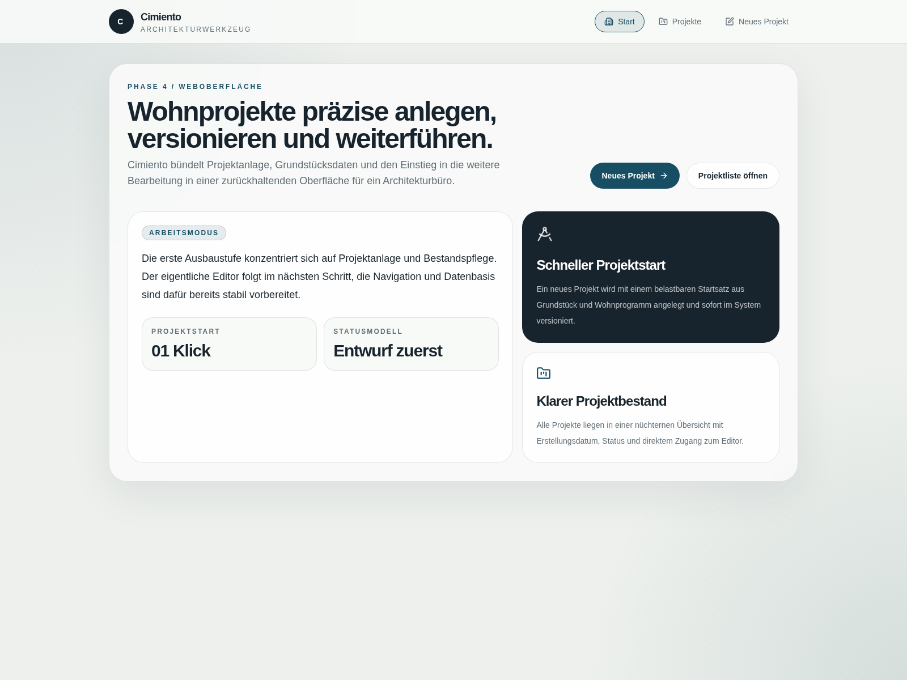
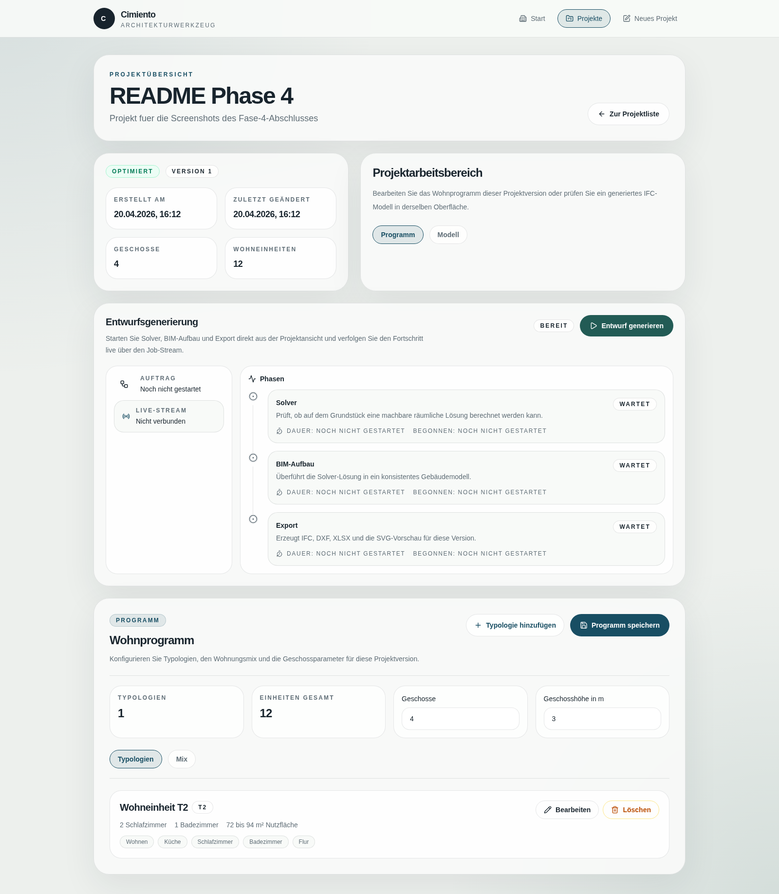
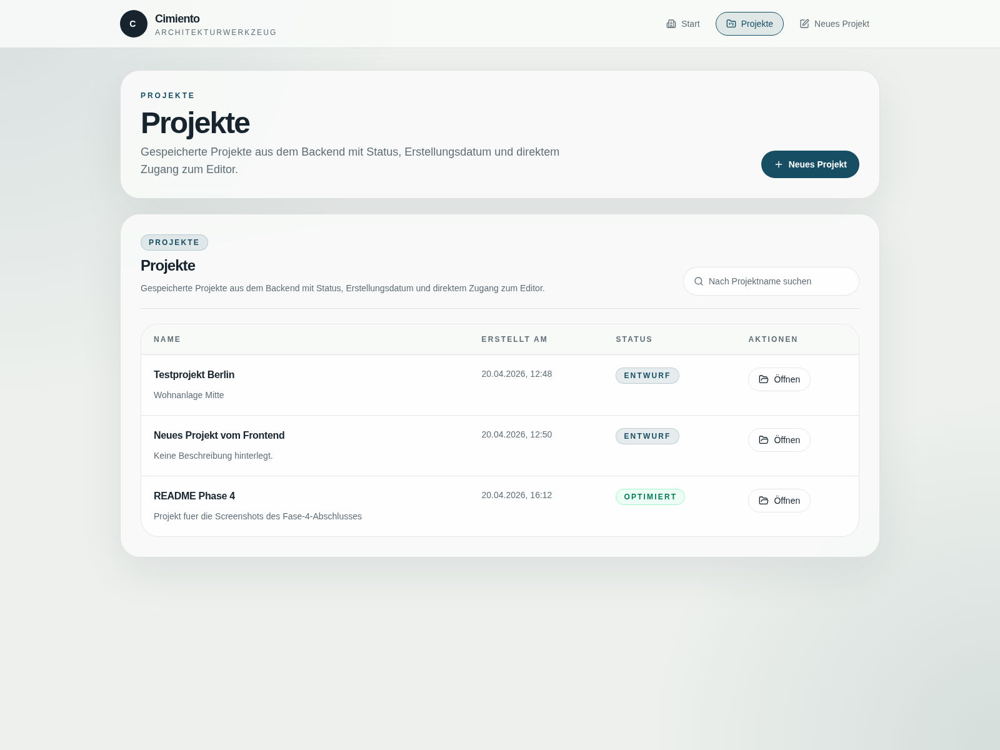

# Cimiento

Cimiento es un producto local de anteproyecto residencial que combina optimización espacial, generación BIM abierta y una interfaz web operativa de extremo a extremo. A fecha de este hito, la base usable ya existe sin copiloto de IA: se puede crear un proyecto, definir solar y programa, lanzar la generación, revisar el progreso en vivo, visualizar el IFC y descargar los outputs.

## Estado actual

- Fase 4 completada el 2026-04-20.
- Siguiente hito: Fase 5, copiloto conversacional sobre la base ya operativa.
- Flujo usable sin LLM: proyecto -> edición -> generación -> visor IFC -> descarga.

## Capacidades de Fase 4

- API FastAPI funcional para proyectos, generación, jobs, salud y descargas.
- UI web en alemán con listado de proyectos, edición, progreso en vivo y descargas.
- Visor IFC integrado con árbol espacial, selección, propiedades, cortes por planta y foco por Geschoss.
- Generación síncrona/asíncrona con WebSocket y stepper de fases Solver, BIM-Aufbau y Export.
- Outputs descargables en IFC, DXF, XLSX y SVG.
- Despliegue local con Docker Compose para frontend, backend y base de datos.

## Screenshots







## Stack

- Backend: Python 3.11+, FastAPI, SQLAlchemy, OR-Tools, Shapely, IfcOpenShell.
- Frontend: React 19, TypeScript, Vite, React Router, TanStack Query, i18next, Konva.
- Visor BIM: @thatopen/components, @thatopen/fragments, web-ifc, three.
- Infra: Docker Compose, PostgreSQL/PostGIS, Qdrant y Ollama como servicios opcionales para fases posteriores.

## Arranque rápido

### Docker Compose

```bash
cd infra/docker
docker compose up --build -d
```

Servicios disponibles:

- Frontend: http://localhost:8080
- Backend API: http://localhost:8000
- OpenAPI JSON: http://localhost:8000/openapi.json

Servicios opcionales para fases con IA y RAG:

```bash
cd infra/docker
docker compose --profile ai up -d
```

### Desarrollo local

Backend:

```bash
cd backend
uvicorn cimiento.api.main:app --reload
```

Frontend:

```bash
cd frontend
npm install
npm run dev
```

La configuración por defecto usa el mismo origen del navegador para `/api` y el proxy de Vite en desarrollo.

## Documentación clave

- Progreso de Fase 4: [docs/progress/fase-04.md](docs/progress/fase-04.md)
- ADR del stack frontend: [docs/decisions/0007-stack-frontend-fase-4.md](docs/decisions/0007-stack-frontend-fase-4.md)
- Registro de decisiones: [DECISIONS.md](DECISIONS.md)
- Hoja de ruta: [ROADMAP.md](ROADMAP.md)
- Arquitectura: [docs/architecture/README.md](docs/architecture/README.md)
